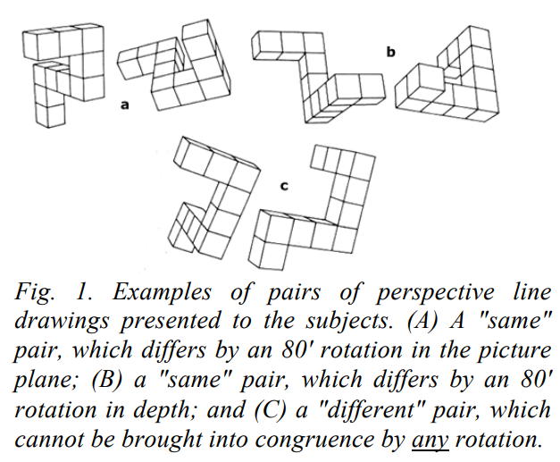
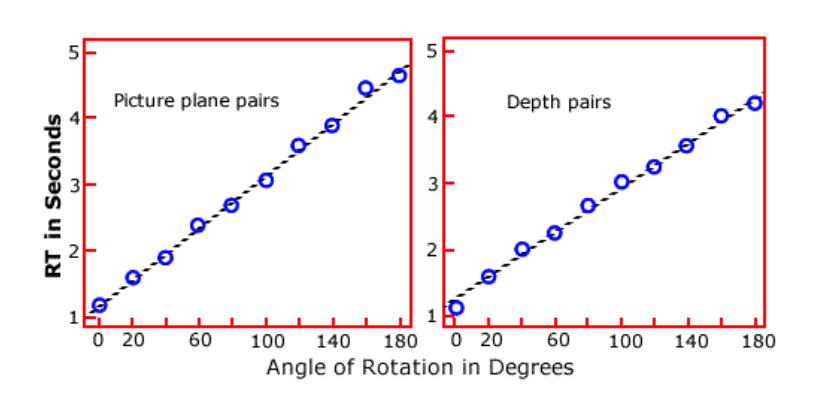

A replication experiment of [Shepard & Metzler (1971)](https://facultypsy.hope.edu/psychlabs/exp/rotate/readings/ShepardMetzler_1971.pdf)
Mental Rotation Task with 3D Rendered Stimuli (Python/Expyriment)

## **Overview**

This repository contains an implementation of a mental rotation experiment inspired by the [landmark 1971 study](https://facultypsy.hope.edu/psychlabs/exp/rotate/readings/ShepardMetzler_1971.pdf) of Roger Shepard and Jacqueline Metzler, which demonstrated that **humans perform mental rotation at a constant angular velocity**. The core empirical finding is a linear relationship between response time (RT) and the angular disparity θ between two 3D objects.

This experiment reproduces this setup with newly generated 3D objects, randomized trials, real-time logging of responses, and automated analysis/plotting.

## **Scientific Background**
### **What is Mental Rotation?**

Mental rotation refers to the ability to mentally manipulate 2D or 3D stimuli—rotate them, flip them, transform them—in order to compare their identity or spatial configuration.
The task involves showing: one object (reference), and a second object rotated by some angle θ. Participants must answer "same object" or "different object".

### **Core Result: Linear RT–Angle Relationship**

Shepard & Metzler (1971) reported a strikingly linear relationship: RT(θ) = α + β θ

where:
- RT = reaction time (ms)
- θ = angular disparity (0°–180°)
- α = baseline reaction time (perception + decision)
- β = mental rotation rate (slope)

The crucial interpretation:
**Humans appear to mentally rotate the object at a constant speed, ~50–60° per second.**

In other words, the brain simulates physical rotation with an analog internal process.

## **Experiment Structure**
### **Task Design**

Each trial shows the reference object (always in canonical orientation) on the left and the test object rotated by θ ∈ {0, 20, 40, ..., 160} degrees on the right.



*Example of objects (made using GeoGebra).*

Trials are either same (identical object, just rotated), or different (mirror or shape variant)

Participants respond using the J key for same object and the F key for different object.

### **Repository Contents**
```bash
.
├── assets/                 # Images for this README
├── stimuli/                # PNG images for each angle & condition
├── mental_rotation.py      # Full Expyriment implementation
├── README.md               # (this file)
├── .gitignore              # Ignore unnecessary files
```
After running the experiment, results are saved in a new folder:
```bash
└── results/                # CSV data + analysis plots
```

### **Data Collected**

Each row in the exported CSV contains:

| Column          | Description                    |
|-----------------|--------------------------------|
| **angle**       | Angular disparity θ (degrees)  |
| **same**        | 1 if same object, 0 otherwise  |
| **repetition**  | Trial index                    |
| **response_same** | Participant answer (1/0)    |
| **correct**     | 1 if response is correct       |
| **rt_ms**       | Reaction time (ms)             |


These are automatically stored in ```results/```.

### **Analysis Pipeline**

The analysis script performs:

- Loading CSV data

- Aggregating RTs per angle

- Computing mean RT(θ)

- Linear regression

- Plotting reaction time vs angular disparity

**Expected output plot:**

- A monotonically increasing RT curve

- A best-fit regression line approximating a straight line

- A slope corresponding to rotation speed

## **How to Run**

1. **Clone repository**
```bash
git clone https://github.com/ArnaudoB/Mental-Rotation-Of-3D-Objects.git
cd Mental-Rotation-Of-3D-Objects
```

2. **Install requirements**
```bash
pip install expyriment numpy matplotlib
```

3. **Launch experiment**
```bash
python mental_rotation.py
```


This produces a timestamped CSV + a regression plot in ```results/```.

## **Scientific Interpretation**

If your regression line is linear with a reasonably high R² (typically > 0.7), you have successfully reproduced the psychological phenomenon: **RT grows linearly with θ (at least for “same” trials)**


*Expected results: RTs increase linearly with angular disparity θ.*

## **References**

Shepard, R. N., & Metzler, J. (1971). Mental rotation of three-dimensional objects. Science, 171(3972), 701–703.
